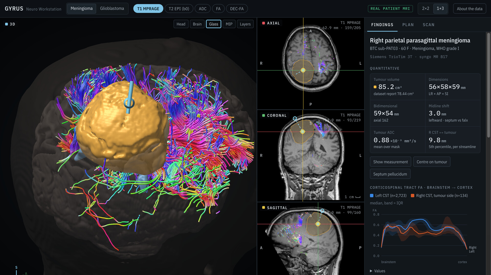
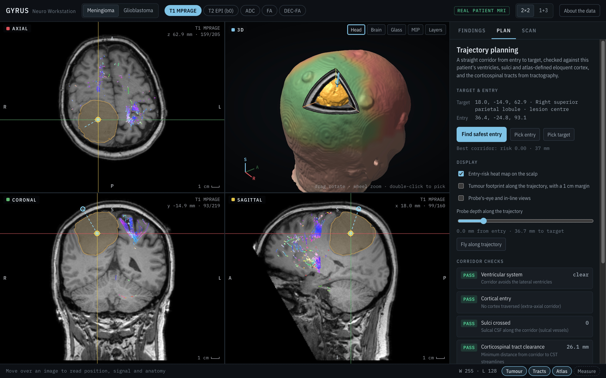
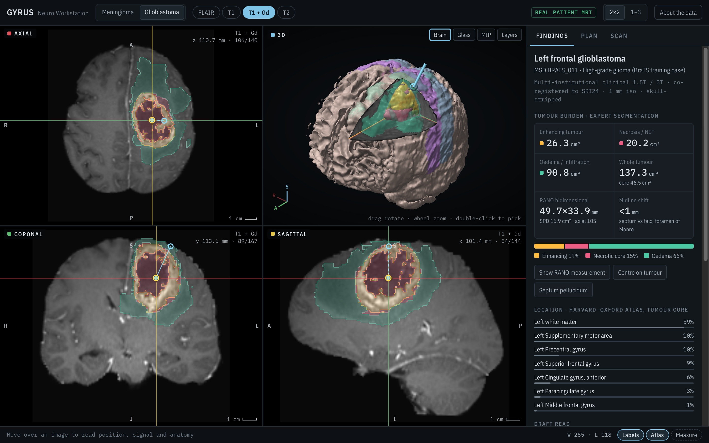

# Gyrus Neuro Workstation

A neuro-imaging workstation that runs entirely in the browser. It loads real, de-identified pre-operative brain MRI and gives you multiplanar views, WebGL2 volume rendering, DTI tractography, tumour measurements, surgical trajectory planning and a k-space acquisition simulator, with no install and no server-side code.

**Live demo: https://nathan1658.github.io/gyrus/**

[](https://nathan1658.github.io/gyrus/media/gyrus-demo.mp4)

▶ **[Watch the 55-second demo video](https://nathan1658.github.io/gyrus/media/gyrus-demo.mp4)**: 3D tractography, trajectory planning and fly-through, k-space acquisition, and the glioblastoma case.

## Features

- **Multiplanar reformatting.** Linked axial, coronal and sagittal slices with a shared crosshair, window/level, zoom and pan, a 2×2 or 1+3 layout, and live readout of position, signal and atlas region under the cursor.
- **3D rendering.** WebGL2 ray-marched head, brain, glass-brain and MIP presets, with an octant cut-away into the tumour.
- **DTI tractography.** Nine named white-matter bundles (corticospinal tracts, arcuate fasciculi, optic radiations, corpus callosum, IFOF), coloured by direction, drawn in 3D and projected onto the slices.
- **Quantitative findings.** Tumour volume and dimensions, RANO bidimensional measurement, midline shift, tumour ADC, tract-to-tumour distance, an FA profile along the corticospinal tracts, atlas-based location, and a drafted radiology read.
- **Trajectory planning.** Automatic search for the safest entry over 3,200 candidate corridors, checked against ventricles, sulci, eloquent cortex and the corticospinal tracts. Includes a scalp risk heat map, probe's-eye views and a fly-through.
- **k-space simulator.** Watch an axial slice being acquired line by line, with linear or centric ordering and switchable noise, motion, spike, fold-over, partial-Fourier and Gibbs-ringing artefacts, reconstructed by inverse 2D FFT.

| Trajectory planning | Glioblastoma with expert segmentation |
| --- | --- |
|  |  |

## Cases

| Case | Data | Source | Licence |
| --- | --- | --- | --- |
| Right parietal meningioma | 1 mm T1 MPRAGE, 101-direction multi-shell diffusion (FA, ADC, DEC), tractography | [OpenNeuro ds001226](https://openneuro.org/datasets/ds001226), Brain Tumor Connectomics, subject PAT03 | CC0 |
| Left frontal glioblastoma | FLAIR, T1, T1+Gd and T2 at 1 mm, with the released expert segmentation | [Medical Segmentation Decathlon](http://medicaldecathlon.com/) Task01, case BRATS_011 (BraTS 2016/2017) | CC BY-SA 4.0 |

Every image voxel is real patient MRI. Tractography, DTI maps, atlas labels (Harvard–Oxford via ICBM152 registration) and all measurements were computed offline for each case. The **About the data** button in the app gives the full pipeline and its limits.

## Running locally

The app is plain static files: native ES modules, no dependencies and no build step. It fetches its modules and case data, so serve it over HTTP instead of opening `index.html` from disk:

```sh
python3 -m http.server 8000
# then open http://localhost:8000
```

Append `#lowgpu` to the URL on weaker GPUs to render the 3D view at reduced resolution.

## Project structure

```
index.html              markup shell; loads css/ and js/main.js
css/
  fonts.css             IBM Plex @font-face rules
  app.css               layout, panels and controls
fonts/                  IBM Plex Sans Condensed + IBM Plex Mono (woff2)
js/
  main.js               boot, render loop, case switching, tabs
  util.js               DOM helpers, vector and matrix math, formatting
  state.js              the case list and shared application state
  io/
    loader.js           fetches a case and decodes its PNG mosaics into volumes
    volume.js           CPU-side sampling, voxel/world coordinates, atlas lookup
  gl/
    shaders.js          GLSL: slice, ray-marched volume, tracts, spheres, lines
    renderer.js         WebGL2 setup, textures, slice and 3D drawing, tract geometry
  ui/
    views.js            viewport cells, layouts, 3D presets, mouse interaction, status bar
    overlays.js         2D canvas overlays: crosshair, labels, tracts, trajectory, RANO
    panels.js           Findings, Plan and Scan tabs, FA chart, About dialog
    ask.js              "Ask" tab (only appears when hosted as a Claude artifact)
  analysis/
    planning.js         distance transforms, corridor risk, footprint
    kspace.js           FFT, k-space acquisition and artefact simulation
cases/<id>/
  meta.json             grid, affine, sequences, labels and precomputed metrics
  a.png … d.png         volumes packed as RGB slice mosaics (three 8-bit channels each)
  tracts.idx, .i16      streamline index and int16 coordinates (meningioma only)
docs/                   screenshots
media/                  demo video (gyrus-demo.mp4) and its cover image
```

## Disclaimer

This is a technical demonstration. It is not a medical device and not for clinical use. Diffusion data were not corrected for EPI distortion, atlas labels are approximate under mass effect, vessels are not segmented, and the written reads are machine-generated drafts.

## Credits and licence

Built with Claude Opus 5.5.

- Code: [MIT](LICENSE).
- Meningioma data: Aerts H, Marinazzo D et al., *eNeuro* 2018 and *NeuroImage* 2020. OpenNeuro ds001226, doi:[10.18112/openneuro.ds001226.v5.0.1](https://doi.org/10.18112/openneuro.ds001226.v5.0.1). CC0.
- Glioblastoma data: Antonelli M et al., *Nat Commun* 2022; Menze BH et al., *IEEE TMI* 2015; Bakas S et al., *Sci Data* 2017. The derived images in `cases/brats011/` are shared under [CC BY-SA 4.0](https://creativecommons.org/licenses/by-sa/4.0/).
- Fonts: [IBM Plex](https://github.com/IBM/plex), SIL Open Font License 1.1.
